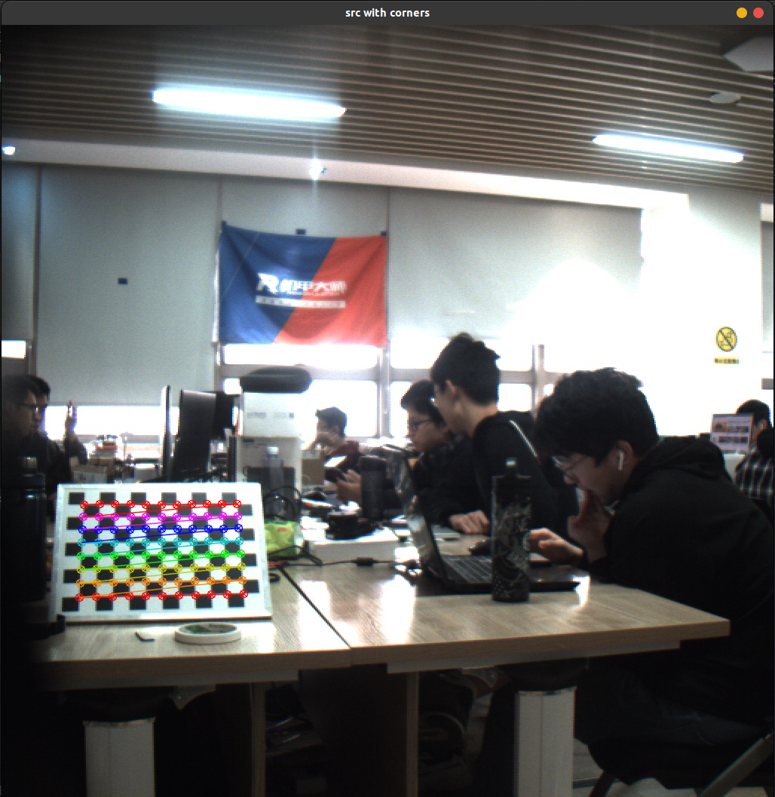
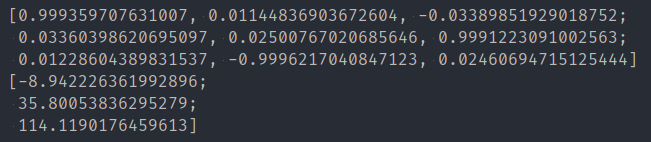
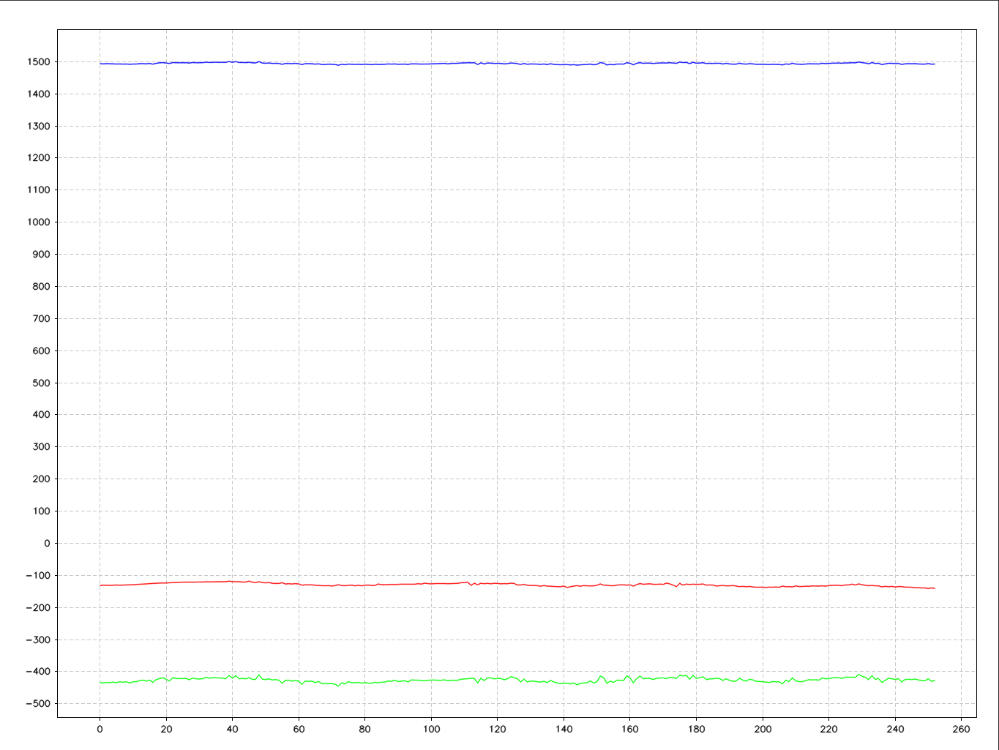

### 一种基于手眼标定的相机系与云台系标定方法

#### 1 使用方法

1. 采集相机内参标定数据：在`get_calib_data.cpp`中定义`FLAG`为0后运行，按`s`采集相机图片数据。
2. 标定相机内参：运行`CamCalib/cali_pre.py`脚本，得到相机内参。
3. 将相机内参写入标定程序：将相机内参写入`CamIMUCalib.cpp`中。
4. 采集手眼标定数据：在`get_calib_data.cpp`中定义`FLAG`为1后运行，按`s`采集相机图片数据和IMU姿态角数据。
5. 运行标定程序：编译运行`CamIMUCalib.cpp`，得到手眼标定结果。

#### 2 使用效果

运行标定程序时会显示标定板角点寻找结果。        

程序运行结束后会打印cam到gripper的旋转矩阵和平移矩阵。      

程序运行结束后会输出一张图片，表示标定板原点在所采集数据中的坐标（base系）变化。三条线分别代表x y z坐标值。      

